# Cursor 使用笔记

- 具体看官网

## 1. 配置

### 1.1 Cursor 配置

- **打开设置**

  - `Cursor Settings`（AI 相关配置）
  - 常用入口：`Ctrl + Shift + J`

- **Privacy Mode（隐私模式）**
  - `Share`：通常能获得更好的推荐与代码行为建议
  - 公司/敏感代码：建议使用更严格的隐私设置（例如 `Privacy`）

### 1.2 编辑器配置（VS Code / Editor Settings）

- `Editor Settings`：编辑器体验相关配置（字体、格式化、保存行为等）

---

## 2. 核心功能

### 2.1 Tab 代码补全

- **全量接受**：`Tab`
- **拒绝**：`Esc`
- **部分接受**：`Ctrl + →`

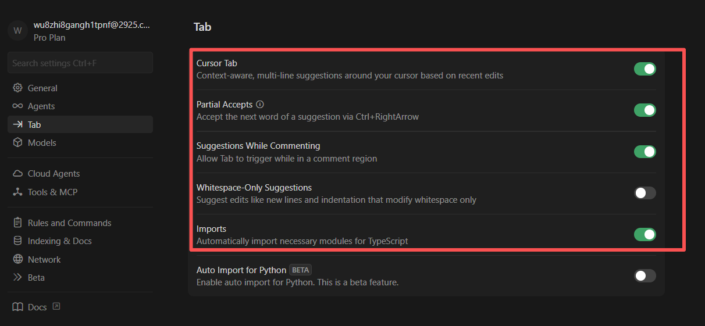

- **单行/多行补全**

  - 鼠标悬停查看候选
  - 触发自动补全后，用 `Tab` 接受

- **代码重写（Rewrite）小技巧**
  - 先写清晰的注释/意图描述
  - 将光标放在注释附近触发建议，然后 `Tab/Accept` 确认

```js
const fn = (data) => {
  const res = data.map((item) => {
    return item.name;
  });
  return res;
};

const data = [
  { name: "John", age: 20 },
  { name: "Jane", age: 21 },
  { name: "Jim", age: 22 },
];

const res = fn(data);
console.log(res);

// 使用 for 重构 fn 函数
const fn1 = (data) => {
  const res = [];
  for (let i = 0; i < data.length; i++) {
    res.push(data[i].name);
  }
  return res;
};

const res1 = fn1(data);
console.log(res1);
```

- **多行协同优化**
  - 基于现有代码规律，智能推断后续语法与结构
  - 典型场景：多行联想、多行批量修改

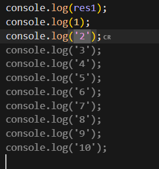
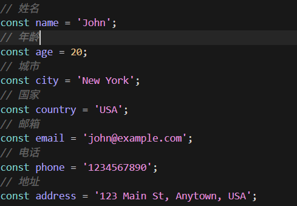

### 2.2 Chat 模式

- **Agent**：对话 + 自动修改代码
- **Debug**：面向问题定位与调试
- **Ask**：以问答为主
- **Plan**：先规划再执行

  - https://cursor.com/cn/docs/agent/modes#plan-1

- **与 Chat 对话的写法建议**

- **提供上下文**

  - 项目语言、框架、业务背景、相关文件/模块

- **分点描述**

  - 将复杂需求拆解为可执行的小目标

- **使用准确技术术语**

  - 提升 AI 理解与落地质量

- **明确边界**

  - 必须保留的功能、禁止的实现方式、性能/安全要求

- **示例引导**
  - 给期望输出示例或参考代码风格

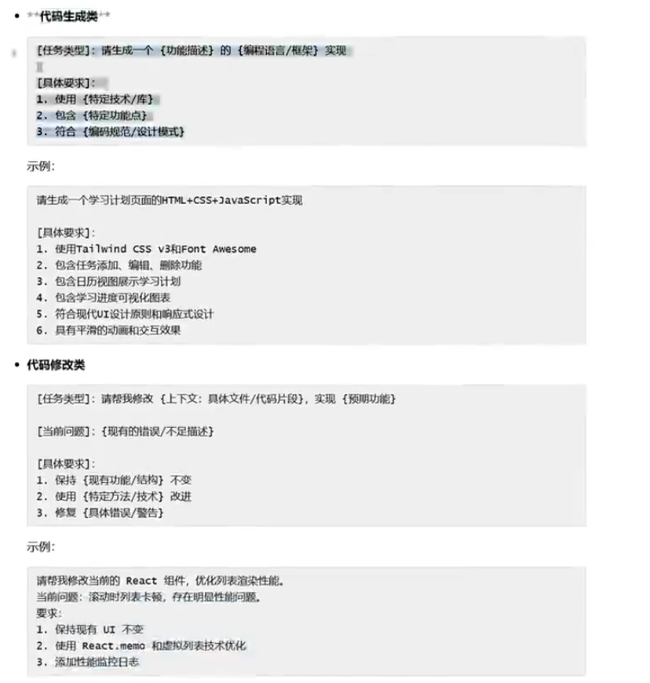
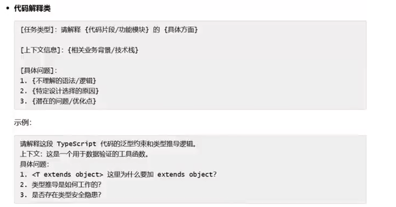
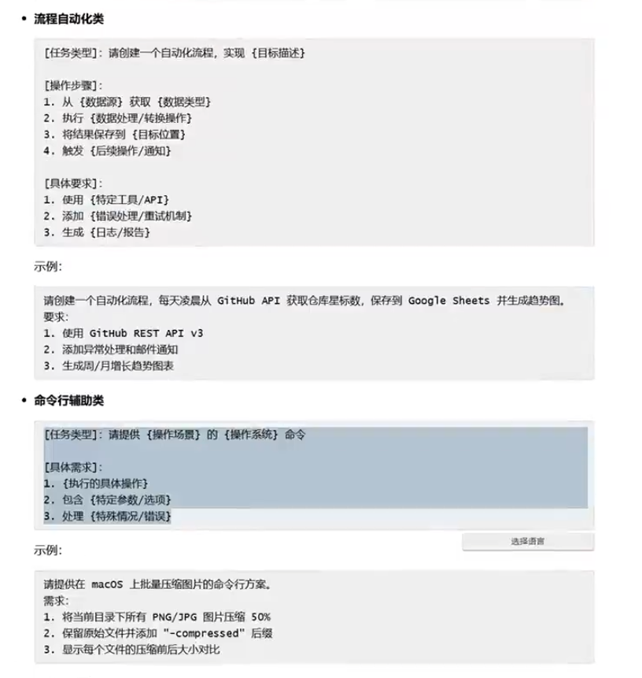

### 2.3 内联生成（Cmd/Ctrl + K）

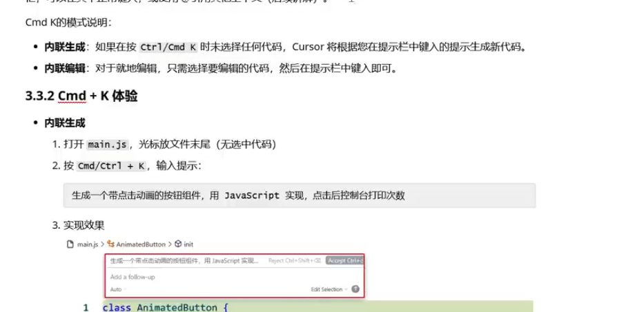

---

## 3. 精准上下文指令

### 3.1 Codebase Indexing（代码库索引）

打开项目时，每个 Cursor 实例会初始化该工作区的索引。初始索引完成后，Cursor 会自动为新增文件建立索引，以保持上下文最新。

索引带来的能力：

- **快速读懂项目结构**

  - 区分工具文件与业务逻辑

- **定位相关代码**

  - 例如搜索 `getUser` 时，能更倾向定位 `userService.js`

- **理解代码关系**
  - 例如 `Order` 与 `Product` 的关联

索引状态位置：`Cursor Settings > Indexing`

`.cursorignore` 的作用：在 `.gitignore` 基础上，额外排除不需要参与索引的文件/目录。

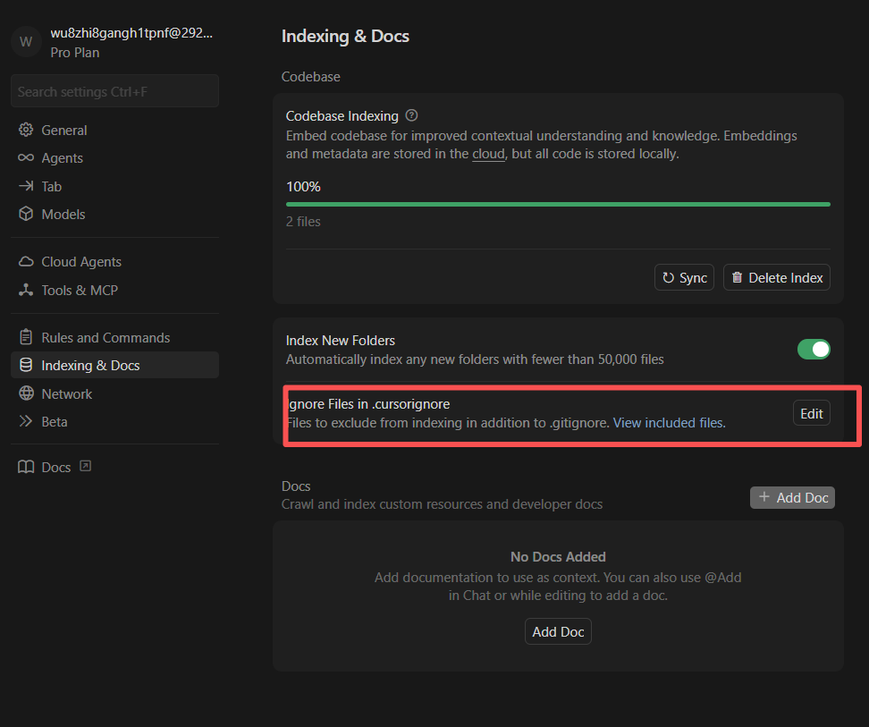

### 3.2 Rules（规则）

Rules 用于给 Cursor AI（适用于 Chat 和 `Cmd/Ctrl + K`）的生成结果添加约束与限制，让生成代码更贴合团队规范，减少二次修改。

主要用途：

- **约束代码风格**

  - 例如强制驼峰命名、要求函数必须注释

- **限定技术选型**

  - 例如禁止使用某老旧库、优先使用项目指定工具类

- **提前指定关键参数**
  - 例如数据库连接地址、账号等（注意不要直接写入敏感信息）

Rules 通常分两种：

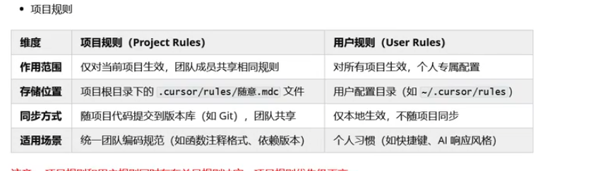

- **项目规则**

  - 使用 `mdc` 语法（类似 Markdown）
  - 注意规则的生效范围

- **用户规则**
  - 直接写描述即可（纯文本）

MDC 语法示例：

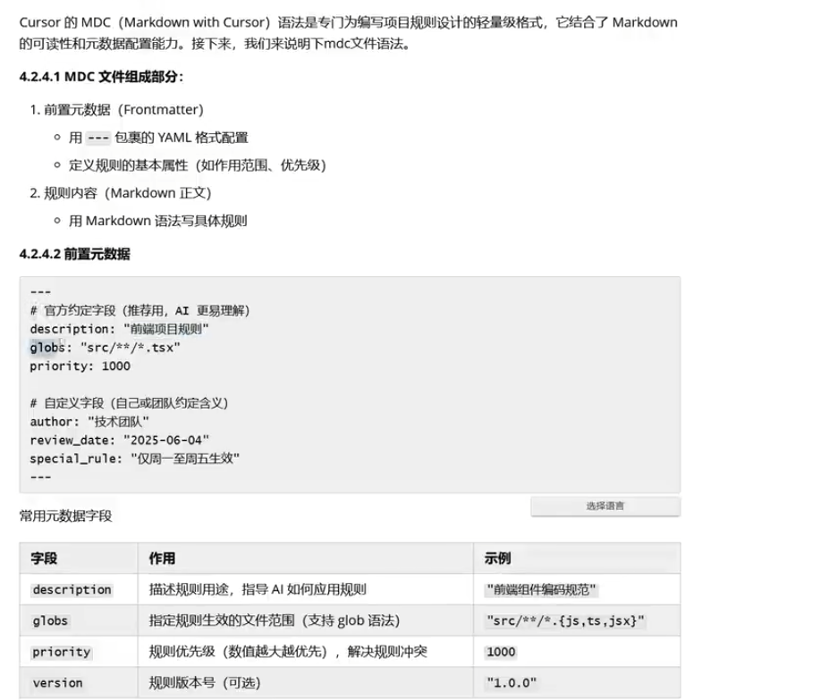
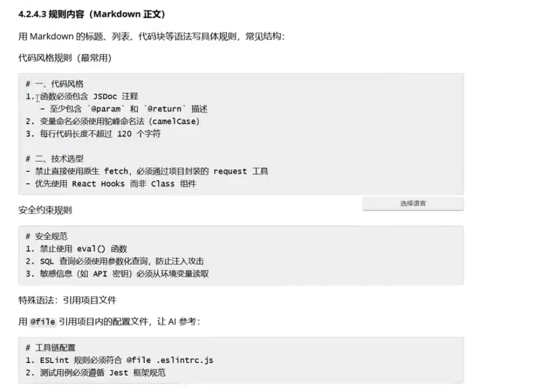
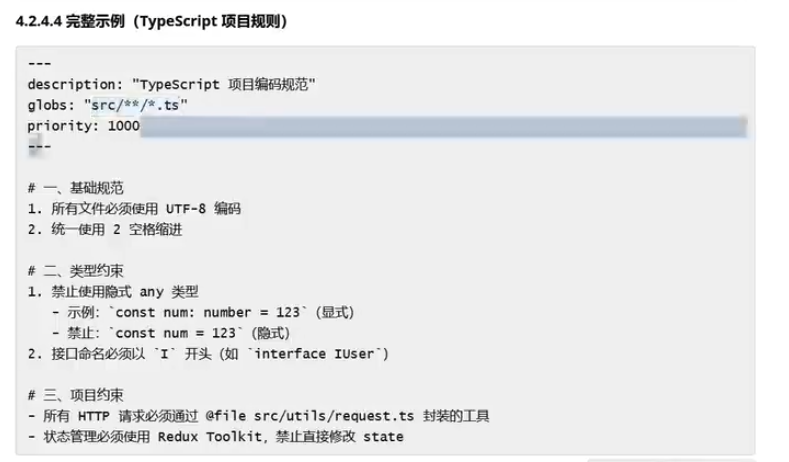

### 3.3 `@` 符号

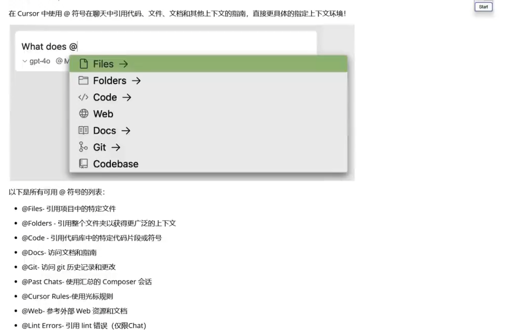
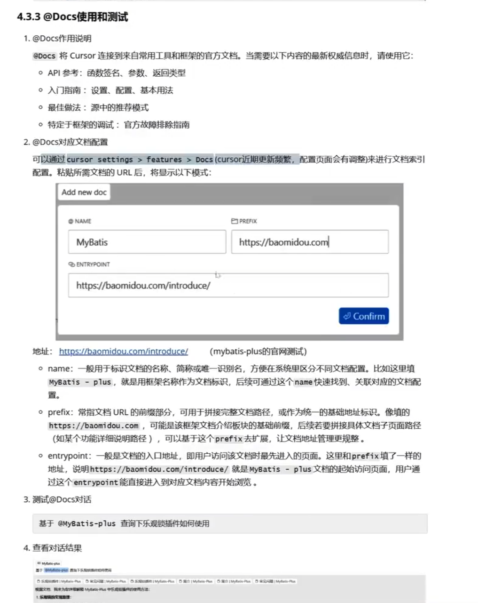

---

## 4. Rules / Skills / MCP（区别与使用场景）

### 4.1 一句话理解（心智模型）

- **Rules（规则）**：给 AI 的“硬约束/偏好说明书”，决定 **应该怎么做、不能怎么做**。
- **Skills（技能）**：可复用的“任务工作流模板/SOP”，决定 **某类任务怎么做更稳、更快**。
- **MCP（Model Context Protocol）**：让 AI 连接外部工具与数据源的 **标准协议**，决定 **AI 能用哪些外部能力**。

记忆法：

- **Rules**：管行为（约束）
- **Skills**：教做事（流程）
- **MCP**：给工具（接入外部系统）

### 4.2 它们分别能解决什么问题

- **Rules 解决**：输出风格统一、工程规范统一、减少反复沟通、避免 AI 乱改。
- **Skills 解决**：把常见任务（Debug/重构/写接口/写测试）沉淀为固定步骤，提高稳定性与产出质量。
- **MCP 解决**：让 AI 不只“看你贴的内容”，还能从外部系统取证与执行动作（查仓库、查文档、查日志、查 issue 等）。

### 4.3 关键区别（对比表）

| 维度             | Rules                   | Skills          | MCP                       |
| ---------------- | ----------------------- | --------------- | ------------------------- |
| 核心关注         | 该不该/能不能这样做     | 怎么做更稳      | 能接入哪些外部工具/数据   |
| 形态             | 约束/偏好（提示词体系） | 流程模板/能力包 | 协议 + 连接器（工具接入） |
| 影响范围         | 风格、边界、工程约定    | 执行步骤与质量  | 上下文来源、可调用工具    |
| 是否需要外部系统 | 否                      | 否（可选）      | 是                        |

### 4.4 实际应用场景（落地例子）

- **Rules（长期固定）**

  - 个人：默认中文输出、先结论后解释、给验证步骤。
  - 团队：限制技术选型、禁止改 public API、改动尽量小、先读文件再改。

- **Skills（任务复用）**

  - Debug：复现 -> 定位 -> 修复 -> 验证。
  - 重构：全局搜引用 -> 分批改 -> 跑测试/验证。

- **MCP（工具闭环）**

  - 连接 GitHub/Jira/知识库/日志平台：让 AI 自动“找证据”，而不是靠你手动粘贴。
    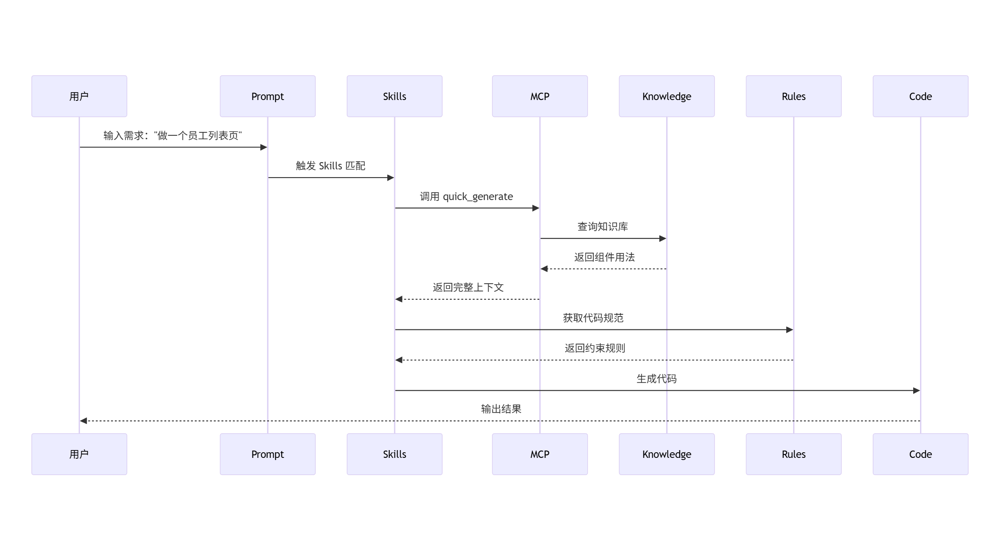
